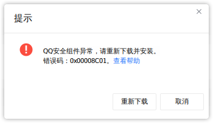
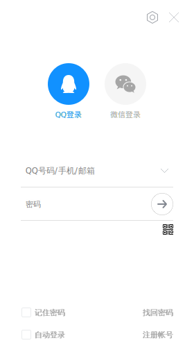

# Docker TIM WeChat

## 简介

在任意Linux发行版上通过Docker运行基于Deepin Wine的TIM和WeChat！

目前已经完成TIM适配，WeChat还在调试。

## 依赖

- [Docker](https://docs.docker.com/engine/install)
- [Docker Compose](https://docs.docker.com/compose/install)
- [Docker non-root](https://docs.docker.com/engine/install/linux-postinstall/#manage-docker-as-a-non-root-user)

## 使用

本项目使用Arch或Ubuntu镜像，根据个人喜好选择均可，这里以Arch为例。

允许其他用户图形显示：
```bash
xhost +
```

进入对应目录：
```bash
cd arch
```

替换音视频组ID：
```bash
sed -i "s/996/$(getent group audio | cut -d: -f3)/g" docker-compose.yml
sed -i "s/985/$(getent group video | cut -d: -f3)/g" docker-compose.yml
```

建立TIM和WeChat用户文件夹：
```bash
mkdir -p $HOME/Documents/{Tencent\ Files,WeChat\ Files}
```

初次运行Docker Compose：
```bash
docker-compose up -d
```

Ubuntu的TIM和WeChat自动安装，Arch的TIM需要点击安装，启动可能报错：



重启即可，之后运行也是同样命令：
```bash
docker-compose restart tim-wechat
```


如需调试进入容器：
```bash
docker-compose exec tim-wechat bash
```

重新生成并启动容器：
```bash
docker-compose up --build -d
```

删除容器：
```bash
docker-compose down
```

## 致谢

感谢[Wine](https://www.winehq.org/)为类UNIX平台运行Windows程序作出的努力，[Deepin](https://www.deepin.org/)对其的进一步优化和对TIM、WeChat的适配，以及Arch用户[Codist](https://aur.archlinux.org/account/Codist)提供和维护的AUR包。
