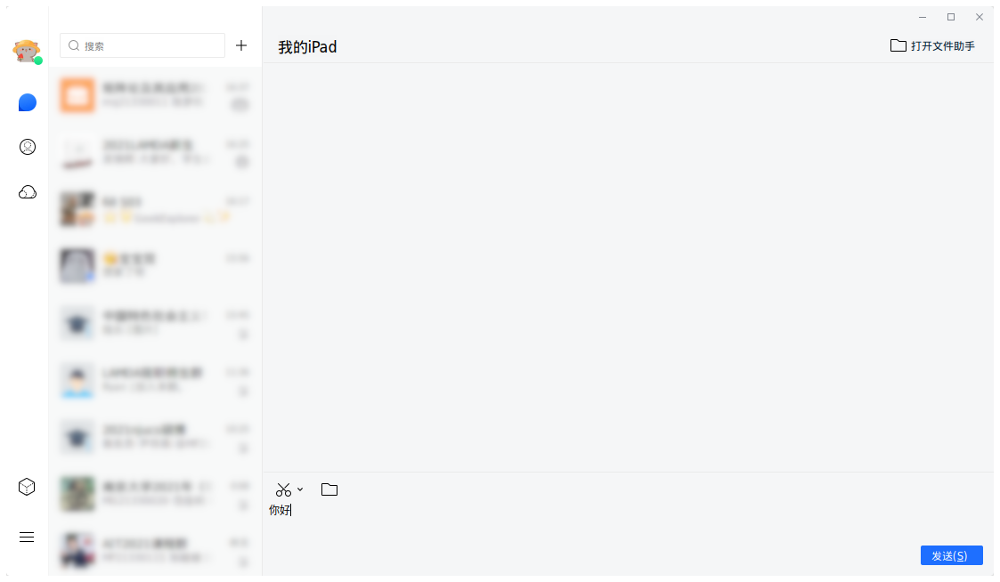
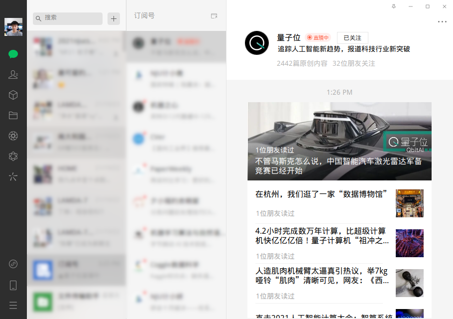
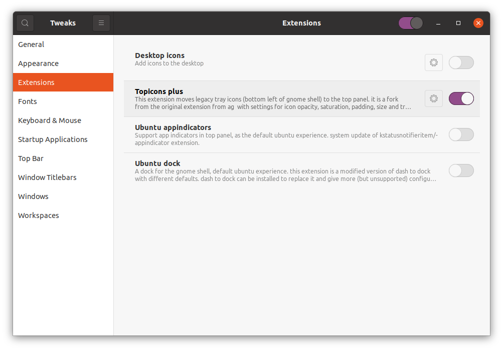
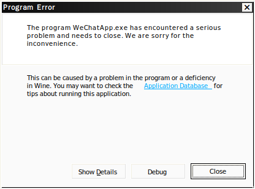

# Docker TIM WeChat

## 简介

在任意Linux发行版上通过Docker运行基于Deepin Wine的TIM和WeChat！





## 依赖

- [Docker](https://docs.docker.com/engine/install)
- [Docker Compose](https://docs.docker.com/compose/install)
- [Docker non-root](https://docs.docker.com/engine/install/linux-postinstall/#manage-docker-as-a-non-root-user)

## 使用

本项目使用Arch或Ubuntu镜像，根据个人喜好选择均可，这里以Arch为例。

允许其他用户图形显示：
```bash
xhost +
```

进入对应目录：
```bash
cd arch
```

替换音视频组ID：
```bash
sed -i "s/996/$(getent group audio | cut -d: -f3)/g" docker-compose.yml
sed -i "s/985/$(getent group video | cut -d: -f3)/g" docker-compose.yml
```

建立TIM和WeChat用户文件夹：
```bash
mkdir -p $HOME/Documents/{Tencent\ Files,WeChat\ Files}
```

初次运行需要构建镜像：
```bash
docker-compose up -d
```

以后运行只需重启容器：
```bash
docker-compose restart tim-wechat
```

如需调试进入容器：
```bash
docker-compose exec tim-wechat bash
```

重新生成并启动容器：
```bash
docker-compose up --build -d
```

关闭并删除容器和镜像：
```bash
docker-compose down --rmi all
```

## 常见问题

### 没有图形显示

不要忘记执行`xhost +`，特别是电脑重启以后。

### GNOME系统托盘

依赖[TopIcons Plus](https://extensions.gnome.org/extension/1031/topicons/)解决，Debian系通过下面命令安装：

```bash
sudo apt install gnome-shell-extension-top-icons-plus
```

注销重新登录，在应用中找到Tweaks，启用插件。



### 文件传输

宿主机用户目录已经挂载在容器的`/home`目录下，可供发送文件。TIM和WeChat的数据目录也被挂载或链接，位于宿主机`~/Documents`，方便接收文件。

### Arch的TIM启动报错

Arch第一次启动TIM可能报错：


执行上面重启命令即可：


### Wine程序错误

遇到以下错误无需理会直接关闭：



### 程序闪退

TIM或WeChat后台运行有时闪退，原因目前还不清楚，通过重启容器解决。


## 致谢

感谢[Wine](https://www.winehq.org/)为类UNIX平台运行Windows程序作出的努力，[Deepin](https://www.deepin.org/)对其的进一步优化和对TIM、WeChat的适配，以及Arch用户[Codist](https://aur.archlinux.org/account/Codist)提供和维护的AUR包。
